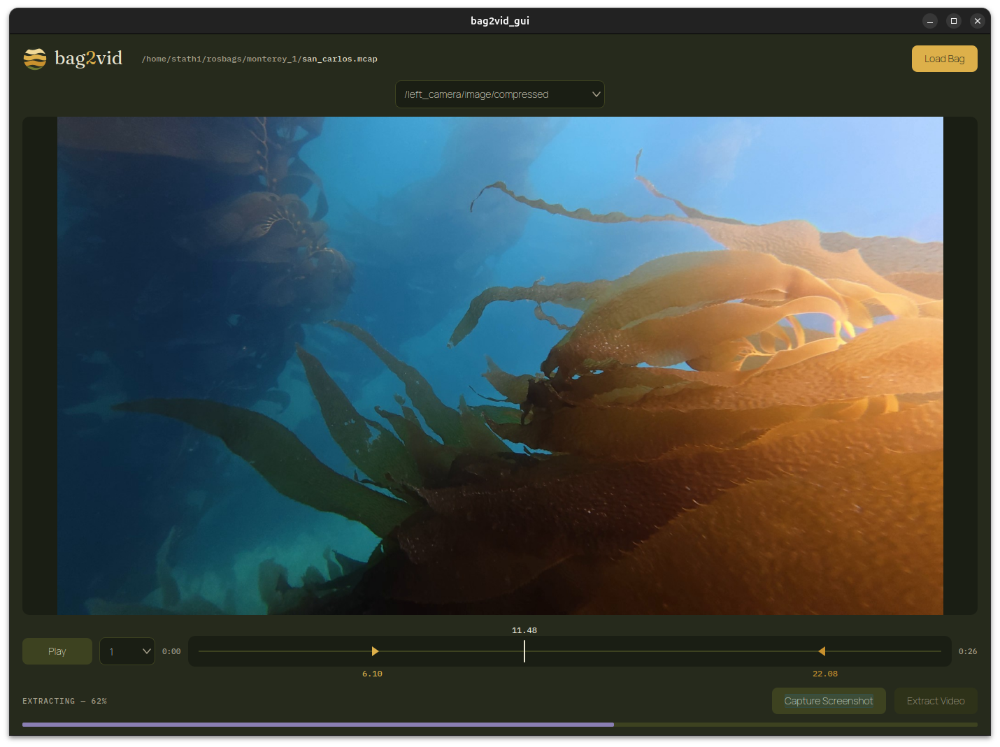

# bag2vid
A GUI tool to extract videos from a rosbag. Supports ROS 2 Jazzy with MCAP bag formats.

> **Looking for the ROS 1 (Melodic) version?** See the [`ros1/melodic`](https://github.com/stathiw/bag2vid/tree/ros1/melodic) branch.


## Install
1. Clone the repository
```
git clone git@github.com:stathiw/bag2vid.git
```
2. Add bag2vid command to bashrc
```
cd bag2vid/scripts
./install.sh
```
3. Modify the environment variables in the bashrc to correctly reference your rosbag source folder and bag2vid image tag.

## Build

### Docker

1. Set rosbag src folder
```
export BAG2VID_SRC=/path/to/rosbag_src
```
2. Build or pull the docker image
```
cd bag2vid
docker compose build
```
or
```
docker pull stathiw/bag2vid:latest
```
## Run
After completing the install and either building or pulling the docker image, the application can be run using either
```
bag2vid
```
or
```
cd bag2vid
docker compose run ros_melodic rosrun bag2vid bag2vid_gui
```

#### How to use
Use the **_Load Bag_** button to select a rosbag to extract videos from.

Select the camera topic to extract from the dropdown.  Upon loading a rosbag, all camera topics will be found.

Press the **_Extract Video_** button and enter a file name and location to save the extracted video.

Drag the start (green) and end (red) time selection markers to select the times between which to extract a video.

Press the **_Capture Screenshot_** button to save the current frame as a png.



## ⚖️ License & Terms of Use

This project is licensed under a **Copyleft + Non-Commercial Redistribution** model.

### 🟢 You CAN:
* **Use it for work:** Use this tool internally at your company for free.
* **Modify it:** Change the code to fit your needs (as long as those changes stay open-source).
* **Share it:** Give the code to others, provided you keep my name on it and use this same license.

### 🔴 You CANNOT:
* **Sell it:** You cannot charge people to download this software.
* **SaaS it:** You cannot build a website that charges people to use this software's features.
* **Close the Source:** You cannot take this code and put it into a "closed" proprietary product.

### 💰 Want to sell this?
If you want to integrate this into a paid product or service, you need a **Commercial Waiver**. This will involve a royalty agreement or a licensing fee. 

Reach out at: **stathi.weir@gmail.com**
